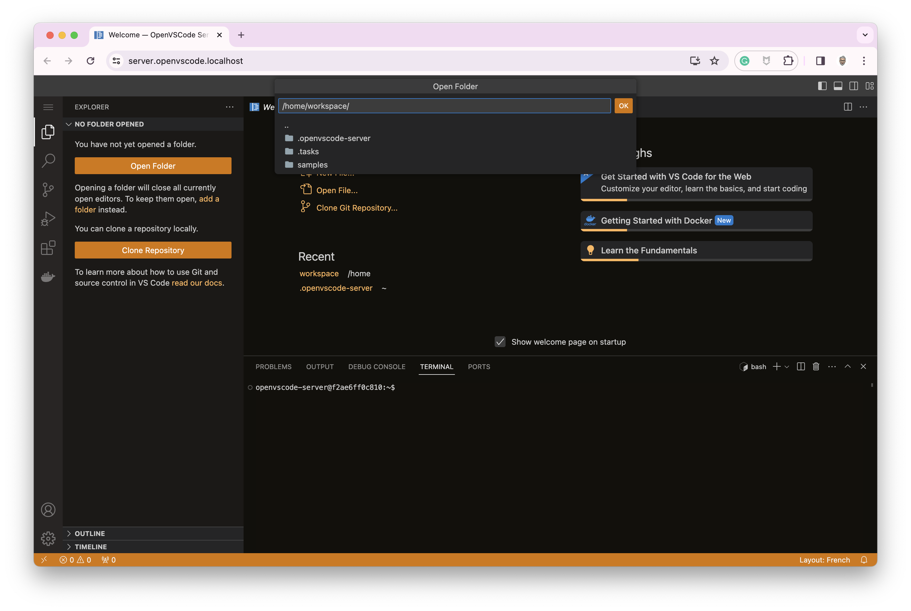

# 🍊 OpenVSCode-server with 🐳 Docker Compose

This project is a Docker Compose project. The main objective is to get a Web IDE based on the [OpenVSCode Server project](https://github.com/gitpod-io/openvscode-server).

To run it correctly, you need TLS certificates.
> I use [mkcert](https://github.com/FiloSottile/mkcert) to create a local CA and generate certificates.

## What is installed on this development environment?

- NodeJS
- Golang
- TinyGo
- Docker

## Setup

### TLS Certificates

Install [mkcert](https://github.com/FiloSottile/mkcert)

> On macOS: `brew install mkcert`

#### Create your own certificate authority and public key infrastructure

```bash
# just once
# Install a new local CA in the system trust store
mkcert -install
```

#### Generate certificate

```bash
cd certs
mkcert \
-cert-file openvscode.localhost.crt \
-key-file openvscode.localhost.key \
openvscode.localhost "*.openvscode.localhost" openvscode.test localhost 127.0.0.1 ::1
```

#### Update hosts file

```bash
0.0.0.0 openvscode.localhost server.openvscode.localhost
```

#### Update the Caddy configuration

If you change the domain name, you have to update this file: `./caddy/Caddyfile`

### Add software to your development environment

Update this file: `.docker/Dockerfile`

> see the `Install NodeJS` section
> - ✋ I defined the version on NodeJS in the `.env` file with:
>   ```
>   NODE_DISTRO=linux-arm64
>   NODE_VERSION=v21.1.0
>   ```
> - I use these environment variables into these files:
>   - `.docker/Dockerfile`
>   - `compose.yaml`

### Add VSCode extensions at start

Update this file: `workspace/.tasks/init.sh`

## Start the local development environment

```bash
docker compose up
```
> ⏳ Wait for some seconds

Then, 🌍 open: https://server.openvscode.localhost





